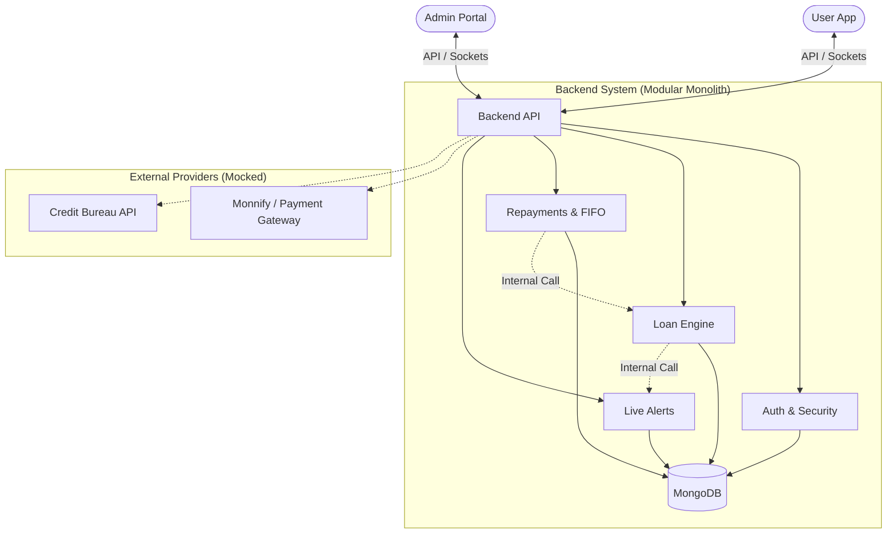

# Loan Management System - Backend Assessment (Ennovate Lab)

This is my implementation of a secure, full-stack loan management system. While the core of this assessment is the **Backend API**, I also built two frontend portals (User and Admin) to properly test the real-time components and the end-to-end financial flow.

---

## 🏗 How it's Built (Architecture)

I chose a **Modular Monolith** architecture. This keeps the codebase clean and easy to navigate without the overhead of microservices, while ensuring that domains like Auth, Loans, and Payments are decoupled enough to be split into separate services if the system scale increases.

### System Overview


### Why this setup?
- **Real-time Updates**: I integrated **Socket.io** because in fintech, users need immediate feedback on loan status changes or payment confirmations without refreshing the page.
- **Communication**: Standard operations use RESTful APIs, while the real-time layer handles instant notifications for both admins and users.

---

##  Facing the "Hard Stuff"

### Concurrency & Failures
Handling money requires extra care. If a user double-clicks "Pay," we cannot charge them twice.
- **Idempotency Engine**: I implemented idempotency keys for all critical financial transactions. If the backend receives a key it has already processed, it returns the previous result instead of performing the action again.
- **Consistency**: The system uses a "Check-Then-Act" pattern. Before any disbursement or payment verification, the current state is re-validated in the database to prevent race conditions.
- **Graceful Failbacks**: If a user is offline during a WebSocket event, the notification is persisted in MongoDB so they see it the moment they log back in.

### Security & Privacy
- **Data Encryption**: Sensitive fields like BVNs and phone numbers are encrypted at rest using **AES-256-CBC**. They are never stored in plain text.
- **Access Control**: Roles are strictly enforced via JWT middleware, separating standard User actions from critical Admin management routes.
- **API Protection**: Included rate limiting on authentication routes and Helmet security headers to harden the HTTP layer.

---

## 💾 Thinking about Data

### MongoDB Modeling Decisions
- **Embedded Documents**: I used embedding for data that is intrinsically part of its parent (like disbursement details inside a Loan). This ensures atomic updates and high read performance.
- **Audit Trails**: Every single financial event or status transition is recorded in an immutable audit log, capturing the "before" and "after" states along with the performer's ID.

### The Loan Engine
- **State Machine**: A robust status flow (Pending → Under Review → Approved → Disbursed → Active → Completed).
- **FIFO Repayments**: Payments are automatically allocated to the oldest outstanding installments first using a First-In-First-Out logic.
- **Manual Verification**: Includes a "Proof of Payment" workflow for bank transfers that require admin approval.

---

## 🛠 Tech Stack

- **Runtime**: Node.js 18+ (TypeScript)
- **Database**: MongoDB + Mongoose
- **Messaging**: Socket.IO (WebSockets)
- **Security**: Crypto (AES), BcryptJS, Helmet

---

## 🚀 Getting it Started

### 1. Environment Setup
Create a `.env` file in the backend root:
```env
PORT=5000
MONGODB_URI=mongodb://localhost:27017/loan_app
JWT_SECRET=5a3e7b1c-4f8d-4e9a-9c8b-7d6e5f4a3b2c
JWT_EXPIRES_IN=7d
NODE_ENV=development
CORS_ORIGIN=*
ADMIN_SECRET_KEY=123456
ENCRYPTION_KEY=a7b3c9d1e5f2g8h4i6j0k2l8m4n6o0p1
```

### 2. Installation & Run
```bash
npm install
npm run dev
```

---

## API Overview (Highlights)

### For Users
- `POST /api/auth/register` - Secure registration
- `POST /api/loans` - Submit loan application (Idempotent)
- `POST /api/payments/upload-proof` - Submit transfer receipt for verification

### For Admins
- `GET /api/admin/loans` - Full pipeline visibility
- `POST /api/admin/loans/:id/approve` - Approve with audit logging
- `POST /api/payments/verify` - Confirm user bank transfers
- `POST /api/payments/refund` - Process overpayment refunds

---

## Tradeoffs & Future Plans

- **Background Jobs**: Currently, notifications and some logic run in the main loop. I'd move these to a worker queue (like BullMQ + Redis) for production.
- **Cloud Storage**: Receipts are currently stored locally. Production should use AWS S3 or Google Cloud Storage.
- **Documentation**: For a production API, I would generate interactive docs using Swagger/OpenAPI.

---
*Developed as a technical assessment for Ennovate Lab.*